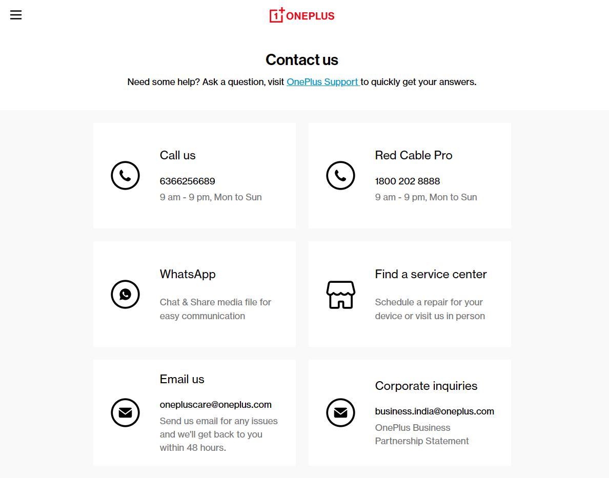
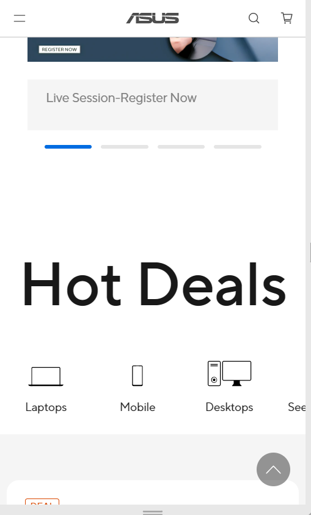

# Questions 1

>document.querySelectorAll(' div#sidebar-wrapper-left div.crayons-card  h2')[0].innerHTML = "Navdeep";

>document.querySelectorAll(' div#sidebar-wrapper-left div.crayons-card  p')[0].innerHTML = "I am a frontend developer";

# Question 2

>let arr = [];

> arr = document.querySelectorAll('div.as-imagegrid-wrapper div.as-imagegrid-item span ');

> let newarr = [];

> arr.forEach((span)=>{
    newarr.push(span.innerHTML)});

# Question 3

> let newNode = document.querySelector(".accordion-homepage").firstChild;

> let clonedNode = newNode.cloneNode(true);

> clonedNode.firstChild.innerText = 'My New FAQ';

> document.querySelector(".accordion-homepage").appendChild(clonedNode);

# Question 4

> document.querySelector(".contactUs--content").firstChild.childNodes[0].querySelector('.item--subtitle').innerText="6366256689"

# Question 5

> document.querySelector('.rpannel').firstChild.querySelector('.button-collection .buynow a').innerText= "Check out"

# Question 6

> document.querySelector('._auxiliary_menu_558sn_31').firstChild.querySelector('input').onmouseover = function(){ this.style.backgroundColor ='red';}

# Question 7

> document.forms['hp-search-form'].elements['hp-search-input'].value = 'CSS Selectors'

> document.forms['hp-search-form'].submit()

# Question 8

> let mainDiv = document.querySelector('#SIvCob')

> let aNodes = document.querySelectorAll('#SIvCob a');

> for(let i=0; i<aNodes.length; i=i+2){    mainDiv.removeChild(aNodes[i]);}

# Question 9

> let h1 = document.querySelector('.header_viewport-80 h1')

> h1.style.fontFamily = 'monospace'

> h1.style.color = '#ff4d4d'

# Question 10

> let text = document.querySelector('.btn-cta-big span.login-btn-text')

> text.onmouseover = function(){ this.style.backgroundColor ='red';}

# Question 11

> let logo = document.querySelector('.icon-logo');

> logo.style.backgroundImage = 'url(https://ineuron.ai/images/ineuron-logo.png)'

# Question 12

> let button = document.querySelector('h2 a.btn')

> button.style.backgroundColor='blue'

# Question 13

> document.querySelector('.home22-intro-text p').innerText = 'JSBOOTCAMP'

# Question 14

> document.querySelector('.HotDealsAll__Heading__2fIbe').style.fontSize = '80px'

# Question 15

> let require10 = document.querySelectorAll('h3.ps-title')[4]

> require10.style.textAlign = 'right'

# Question 16

> document.querySelector('.section-title_title__VEDfK span').innerText = 'Start With Scratch'

# Question 17

> document.querySelector('.btn-container a').innerText = new Date()

# Question 18

> document.querySelector('section.p-f03v2__footer').style.backgroundColor = 'orange'

# Question 19

>document.querySelector('a.navbar-brand img').src

# Question 20

> let curretDiv = document.querySelectorAll('.pdl-text-content')[4]

> curretDiv.querySelector('p.pdl-text-description').style.color = 'orange'